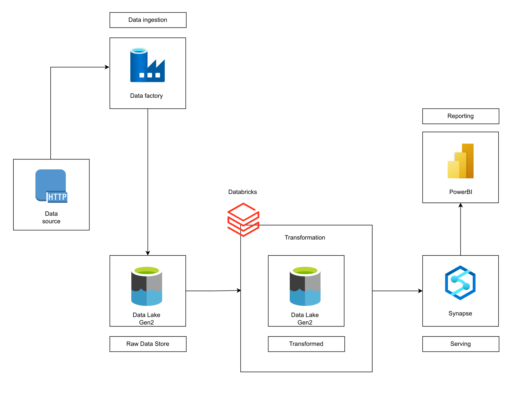

# Azure Data Engineering Platform — AdventureWorks

Projet personnel de Data Engineering réalisé sur Microsoft Azure, autour du dataset AdventureWorks.

L’objectif est de mettre en place une chaîne de données complète, depuis l’ingestion des données brutes jusqu’à leur mise à disposition dans Power BI pour l’analyse.

Le projet permet de travailler sur une architecture Data moderne avec **Azure Data Factory, ADLS Gen2, Databricks, PySpark, Azure Synapse et Power BI**, en suivant une organisation **Bronze / Silver / Gold**.

---

## 🎯 Objectifs

- Mettre en place un pipeline d’ingestion automatisé sur Azure.
- Centraliser les données brutes dans un Data Lake.
- Nettoyer et transformer les données avec PySpark.
- Organiser les données selon une architecture Medallion.
- Préparer une couche de données exploitable pour l’analyse.
- Connecter les données finales à Power BI pour le reporting.

---

## 🏗️ Architecture

L’architecture repose sur plusieurs services Azure :

- **Azure Data Factory** : orchestration et ingestion.
- **Azure Data Lake Storage Gen2** : stockage des données.
- **Azure Databricks / PySpark** : nettoyage et transformation.
- **Azure Synapse Analytics** : structuration et exposition des données.
- **Power BI** : visualisation et reporting.

L’organisation suit une architecture **Bronze → Silver → Gold**.

---

## 🔄 Pipeline de données

### 1. Ingestion — Bronze

Les fichiers AdventureWorks sont récupérés depuis GitHub à l’aide d’**Azure Data Factory**.

Une activité de copie avec un connecteur HTTP permet d’ingérer les différentes sources.

Les données sont ensuite déposées dans **Azure Data Lake Storage Gen2**, dans la couche **Bronze**, sans transformation.

Cette étape permet de conserver les données sources avant leur traitement.

### 2. Transformation — Silver

**Azure Databricks** récupère les données présentes dans la couche Bronze.

Les traitements sont réalisés avec **PySpark** pour :

- nettoyer les données ;
- normaliser les formats ;
- structurer les données ;
- préparer les données pour l’analyse.

Les données transformées sont enregistrées dans la couche **Silver**, au format **Parquet**.

### 3. Mise à disposition — Gold

**Azure Synapse Analytics** exploite les données de la couche Silver.

Un **serverless SQL pool** permet d’interroger les fichiers Parquet stockés dans ADLS.

Des **tables externes et des vues SQL** sont créées afin de structurer les données et de les rendre exploitables pour l’analyse.

Cette couche correspond à la donnée **Gold**, préparée pour le reporting.

### 4. Reporting — Power BI

**Power BI** se connecte à Azure Synapse Analytics.

Les données préparées sont utilisées pour construire des rapports permettant d’analyser les informations issues du dataset AdventureWorks.

Le reporting reste volontairement simple dans cette première version : l’objectif principal est de mettre en pratique la chaîne Data Engineering de bout en bout.

---

## 📂 Données utilisées

Le projet utilise notamment les tables :

- Customers
- Products
- Product Categories
- Product Subcategories
- Sales 2015
- Sales 2016
- Sales 2017
- Returns
- Territories
- Calendar

---

## 🛠️ Technologies

| Domaine | Technologies |
|---|---|
| Cloud | Microsoft Azure |
| Orchestration | Azure Data Factory |
| Data Lake | Azure Data Lake Storage Gen2 |
| Transformation | Azure Databricks, PySpark |
| Stockage | Parquet |
| Data Warehouse / SQL | Azure Synapse Analytics |
| BI | Power BI |
| Langages | Python / PySpark / SQL |
| Architecture | Medallion — Bronze / Silver / Gold |

---

## 📌 Compétences mises en pratique

- Conception d’un pipeline Data de bout en bout
- Ingestion de données
- Data Lake
- Transformation avec PySpark
- Architecture Bronze / Silver / Gold
- SQL
- Services cloud Azure
- Mise à disposition des données pour la BI
- Passage de données brutes à des données exploitables

---

## 📈 Flux global

**Sources → Azure Data Factory → ADLS Bronze → Databricks / PySpark → ADLS Silver → Synapse / Gold → Power BI**

L’objectif est de reproduire une chaîne Data complète avec une séparation claire entre **ingestion, transformation, exposition et reporting**.

---

## 🚀 Améliorations possibles

- Renforcer les contrôles de qualité des données.
- Ajouter davantage de règles de validation.
- Mettre en place un monitoring des pipelines.
- Enrichir le modèle analytique.
- Améliorer les dashboards Power BI.
- Ajouter des tests automatisés.
- Mettre en place une CI/CD.

---

## 🎓 Ce que je retiens

Ce projet m’a permis de mieux comprendre comment les différents composants d’une plateforme Data s’articulent.

L’objectif n’est pas seulement d’utiliser chaque outil séparément, mais de comprendre **où il intervient dans le pipeline et pourquoi il est utilisé**.

---

## 🔗 Références

Projet réalisé à partir d’une architecture inspirée du projet **Adventure-Works-DE-Project**.

- GitHub de référence : https://github.com/EviAleX/Adventure-Works-DE-Project
- Vidéo / démonstration : https://www.youtube.com/watch?v=0GTZ-12hYtU&t=15907s&ab_channel=AnshLamba

> Projet utilisé comme support d’apprentissage et de mise en pratique. Les résultats chiffrés ne sont pas ajoutés lorsqu’ils ne sont pas disponibles.
